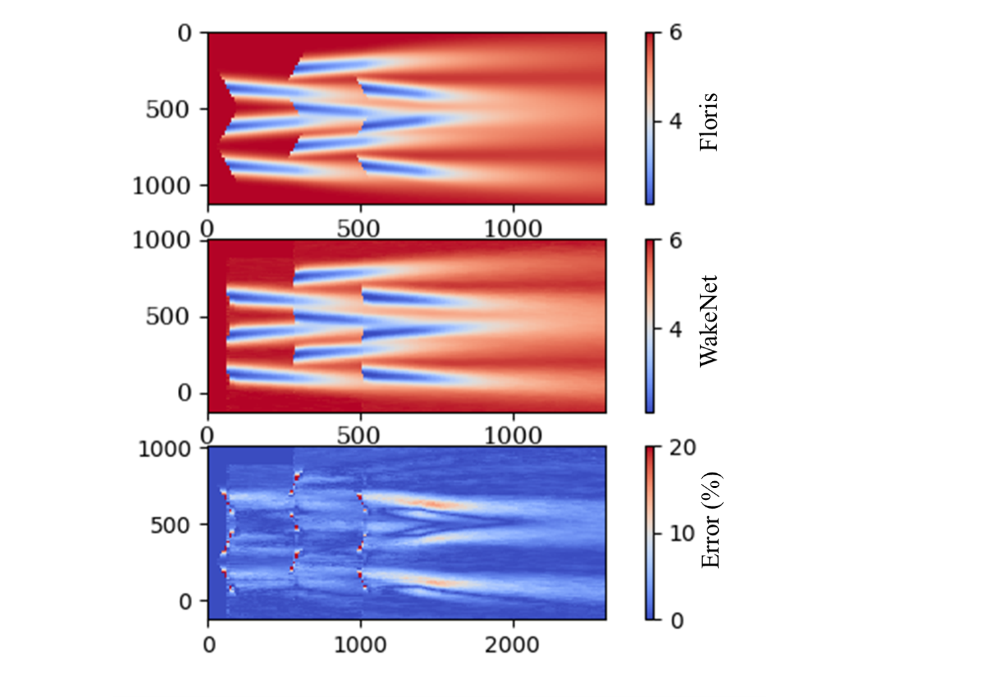

# WakeNet: Deep Neural Networks for Wind Turbine Wake modelling and Optimisation

## Network architecture

## Results

**Abstract**

Offshore wind farm modelling has been an area of increasing interest over the last two decades, with numerous remarkable analytical as well as computational approaches attempting to accurately describe the complex wind flows taking place. The ultimate aim is the development of tools that can be used to provide designs that increase the efficiency in power production. This work presents an open-source Machine Learning (ML) framework for the rapid modelling of wind farm flow field, using a Deep Feed Forward (DFF) neural network architecture, trained on approximate turbine wake fields, as calculated by the state-of-the-art wind farm modelling software FLORIS. The constructed neural model is capable of accurately reproducing the single wake deficits on the hub level of a 5MW wind turbine under yaw and a wide range of inlet hub speed and turbulence intensity conditions, at least an order of magnitude faster than the analytical wake based solution method, yielding results of 98.5% mean accuracy. A superposition algorithm is also developed to construct the wind farm domain of superimposed individual wakes. The ability of the trained neural network in providing reliable results is further demonstrated by performing wind farm yaw and layout optimisations, where the DFF produces optimal solutions one order of magnitude faster than the same optimisation carried out by FLORIS, across a wide range of wind conditions. A promising advantage of the present approach is that its performance and accuracy is expected to increase even further when trained on high-fidelity CFD data through transfer learning, while its computational cost for evaluation is kept low and constant.

